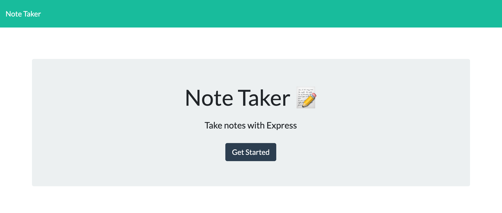
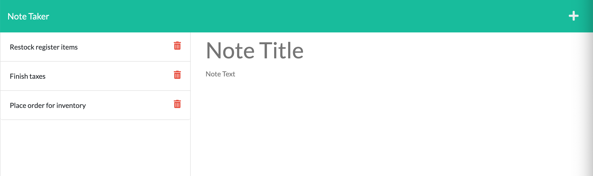
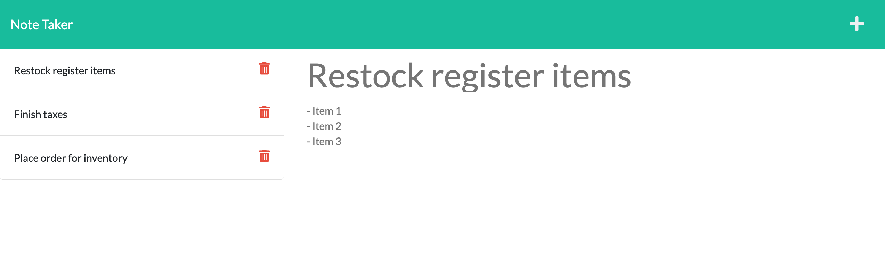

# Note Taker
## Express.js Challenge

## Description 
This repository contains code for a note taking application. The purpose of this challenge assignment is to connect the back end to the front end using Express.js. Configuring the back end required setting up HTML and API routes, with GET, POST, and DELETE request methods, using a db.json file to store and retrieve the notes. This application is deployed using Heroku. 

View the deployed application: https://notetaker-eh.herokuapp.com/

## Table of Contents
* [Installation](#installation)
* [Usage](#usage)
* [Questions](#questions)

## Installation
To install any necessary dependencies run the following command: 

    npm install 

## Usage 
If you want to clone this repo to your local machine, make sure you have node.js and npm installed (hint: `node -v` & `npm -v`). Once within the package, make sure you have express.js and UUID (sets unqiue ID for each note) installed as well (`npm i express` & `npm i uuid`). Deploy locally using `npm start`.

## Questions
If you have any questions or feedback, create a new issue and add the label "question". 
View more of my work: [github.com/emholmes](https://github.com/emholmes).